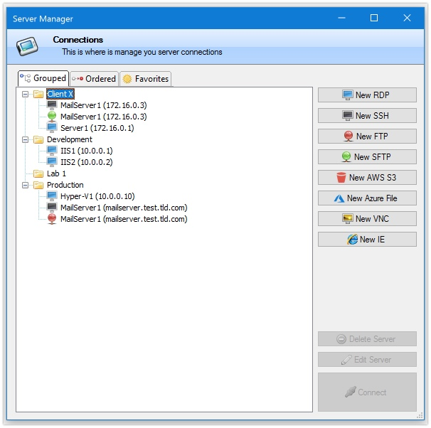
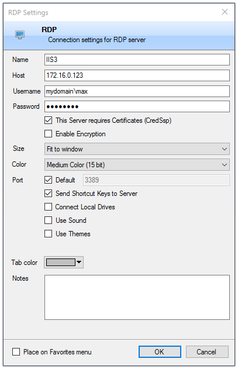
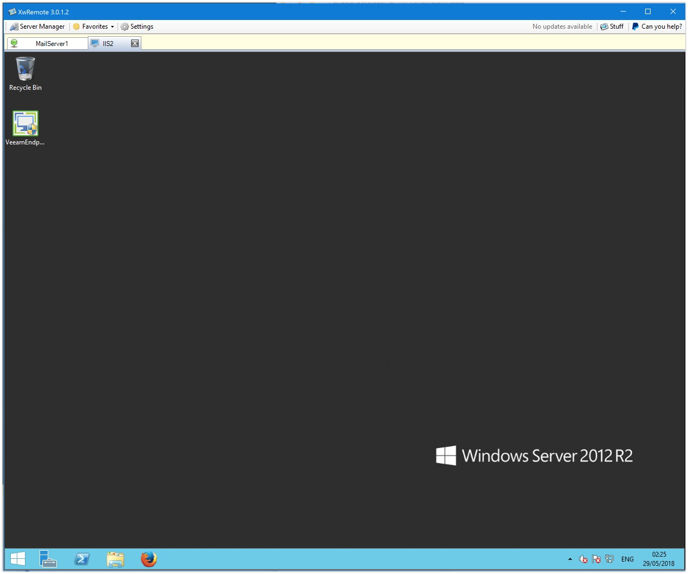
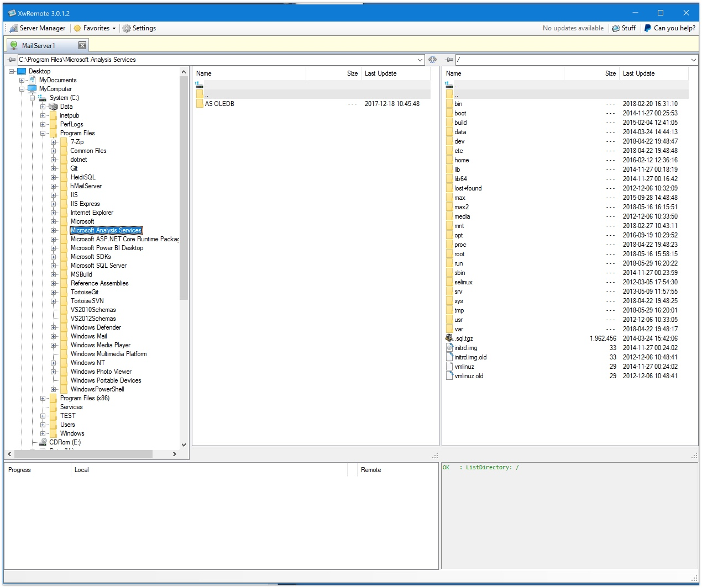

# XwRemote

How do i eliminate the need for many applications and the consequent open and close merry-go-round

For now it supports:
 - RDP 
 - SSH
 - FTP 
 - SFTP
 - AWS S3 Buckets
 - Azure File Storage
 - VNC 
 - IE(!)
 - Master password

The functionality is not the most complete but it will increase over time.
There is always a balance between "complete" and "simple" so...

Anyway, if there is anything that this could make better, let me know!

Next on the list is connecting to SSH/SFTP using Keys.

